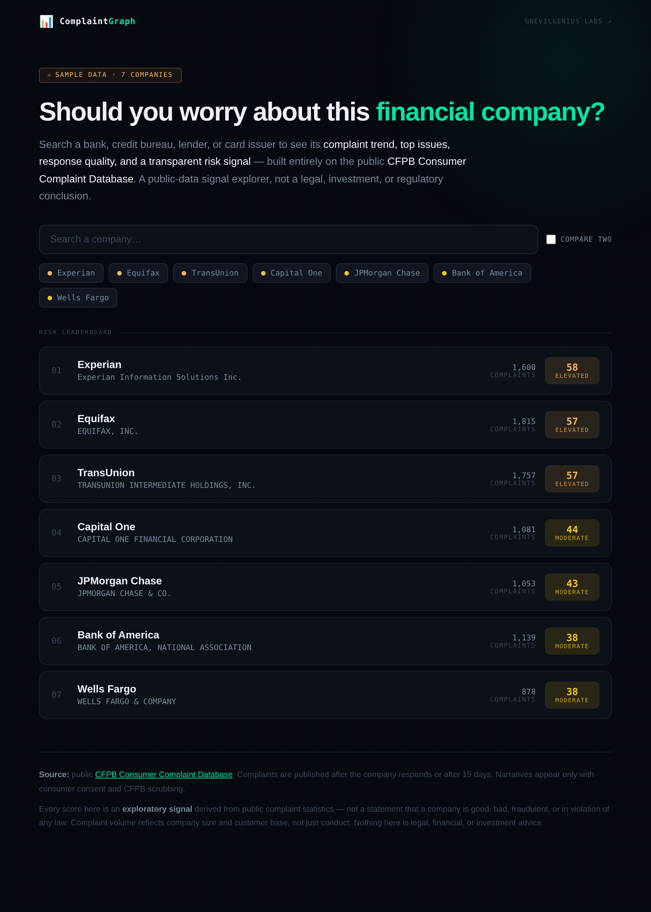

# ComplaintGraph

> Public complaint intelligence for consumer-finance companies — built entirely
> on the public **CFPB Consumer Complaint Database**.

Search a financial company → see its complaint trend, top issues, response
quality, consumer-harm signals, and a **transparent risk signal** with the exact
math behind it. Compare two companies side by side.

ComplaintGraph is a **public-data signal explorer**, not a legal, investment, or
regulatory conclusion tool. Complaint volume reflects a company's size and
customer base, not just its conduct, and every score is labeled as an estimate.

**Live:** https://unevil-warden.github.io/unevil/complaintgraph/



---

## What it shows

For each company in a curated set (credit bureaus, big banks, card issuers):

- **Risk leaderboard** — companies ranked by an exploratory 0–100 risk signal.
- **Complaint volume by month** over an ~18-month window.
- **Top issues, products, and states.**
- **Response quality** — timely-response rate and how cases were closed
  (with/without relief).
- **Transparent risk signal** — a 0–100 score blended from five interpretable
  sub-signals, each shown with its weight and the evidence behind it:
  | Sub-signal | Weight | What it measures |
  |---|---|---|
  | Untimely responses | 0.15 | Share of cases not answered on time |
  | Closed without relief | 0.30 | Share of closed cases ending with no monetary/non-monetary relief |
  | Issue concentration | 0.20 | How dominated complaints are by one issue |
  | Recent trend | 0.20 | Last 3 months vs the prior 3 |
  | Harm language in narratives | 0.15 | Share of consumer narratives mentioning concrete harm |
- **Consumer narratives** — public, consent-given complaint text (when available).
- **Plain-English summary** — generated deterministically from the statistics
  above. No LLM, no fabricated claims.

---

## Architecture

A deliberately small, static, dependency-free app:

```
complaintgraph/
  src/                  # the dashboard (published as-is)
    index.html
    app.js              # vanilla JS, inline-SVG charts, zero dependencies
    styles.css
  scripts/
    lib/analyze.mjs     # single source of truth: records -> per-company stats + signal + summary
    ingest-cfpb.mjs     # fetch live CFPB data, bake to data/*.json
    gen-sample.mjs      # deterministic, clearly-labeled SAMPLE data (same analyzer)
  data/                 # baked JSON the dashboard reads (committed sample; overwritten by live ingest in CI)
    index.json
    companies/*.json
  build-site.mjs        # assemble src/ + data/ into dist/ for local preview
```

The page reads only static JSON — there are **no runtime API calls** and no
backend. Data is baked at build time, exactly like the Surveillance Radar's
`ingest:atlas` step. In CI the live CFPB ingest runs and overwrites `data/`; if
it fails, the committed sample data is kept and clearly labeled in the UI.

---

## Run it locally

Requires Node 18+. No install step, no API key.

```bash
cd complaintgraph

# (optional) regenerate the labeled sample dataset
npm run sample

# (optional) pull a live snapshot from the CFPB API (needs internet)
npm run ingest

# build + serve at http://localhost:5055
npm run preview
```

Then open http://localhost:5055. Serve over HTTP rather than opening
`index.html` directly — browsers block `fetch()` of local files over `file://`.

---

## Data source

[CFPB Consumer Complaint Database](https://www.consumerfinance.gov/data-research/consumer-complaints/)
— a public collection of complaints about consumer financial products and
services, sent to companies for response. Complaints are published after the
company responds and confirms a commercial relationship, or after 15 days,
whichever comes first. Narrative text appears only when the consumer consents
and CFPB scrubbing is applied. No API key is required.

API docs: <https://cfpb.github.io/api/ccdb/api.html>

---

## Honest limits

- Complaint **counts are not a verdict.** A bigger company with more customers
  will generally have more complaints.
- The risk signal is a **heuristic** for "where to look," not a measure of
  wrongdoing or compliance.
- The "harm language" signal is a coarse keyword scan of consumer narratives —
  it reflects how consumers describe their experience, not confirmed harm.
- Sample data is synthetic and labeled as such; it exists only so the page
  renders before/without a live ingest.
