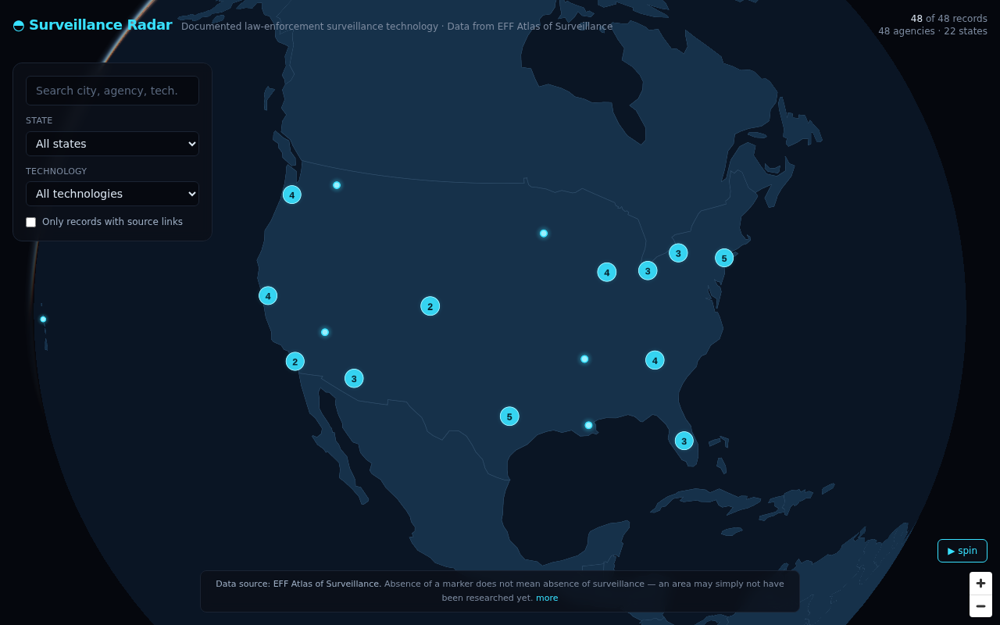

# Surveillance Radar

An interactive, dark **3D globe** that visualizes documented law-enforcement surveillance
technology across the United States — think *FlightRadar24 for surveillance tech*. Spin the
globe, zoom in, and click glowing points to see which agencies use which technologies, with
links back to the supporting evidence.

Data comes from the **EFF Atlas of Surveillance**. This is an independent visualization and is
not affiliated with or endorsed by EFF.



## What it does

- A rotatable 3D globe (MapLibre GL globe projection) on a dark starfield with a soft atmosphere.
- Glowing, clustered points for each surveillance record; clusters expand as you zoom in.
- Click a point to fly in and open a detail drawer: agency, location, technology, vendor,
  description, and **evidence links**.
- Search across agency / city / county / state / technology / vendor, and filter by state,
  technology, or "records with source links only."
- Records stacked on the same city centroid open as an "N records here" list.

## Data source & attribution

> Data source: Electronic Frontier Foundation, **Atlas of Surveillance** (published under CC BY).
> This project is an independent visualization and is not affiliated with or endorsed by EFF
> unless explicitly stated.

**Absence of a marker does not mean absence of surveillance.** It may only mean an area has not
been researched yet or the data has not been updated.

### Additional open-data cross-reference layers

Two optional, **toggleable** layers (off by default) let you cross-reference the EFF deployments
against other public open datasets. Each is ingested at build time and baked to a static file in
`public/` — no runtime API dependency — exactly like the Atlas. Both ship with a small,
clearly-labeled **sample file** so they render offline; the ingest scripts overwrite those files
with live results when network is available. They are styled distinctly from the cyan EFF points
and are toggled from the "Cross-reference layers" panel (top-right).

| Layer | Source | Ingest | Static file | Marker | Attribution |
|-------|--------|--------|-------------|--------|-------------|
| OSM surveillance | OpenStreetMap via Overpass API (`node["man_made"="surveillance"]`, bounded to a small Washington, D.C. bbox) | `pnpm ingest:osm` | `public/osm-surveillance.geojson` | amber | © OpenStreetMap contributors (ODbL) |
| Wikidata agencies | Wikidata SPARQL (law-enforcement agencies, `wdt:P31/P279* wd:Q1414557`, with coordinates `P625`) | `pnpm ingest:wikidata` | `public/wikidata-agencies.geojson` | violet | Wikidata (CC0) |

```bash
pnpm ingest:osm        # overwrites public/osm-surveillance.geojson (keeps sample if offline)
pnpm ingest:wikidata   # overwrites public/wikidata-agencies.geojson (keeps sample if offline)
```

Both ingest scripts use a bounded query + timeout and are **non-fatal on network failure**: if the
endpoint is blocked or rate-limited they keep the committed sample file so the build always has
data. The static files are loaded through the same `NEXT_PUBLIC_BASE_PATH` mechanism as
`public/world.geojson`, so the layers work when served from a subpath (e.g. GitHub Pages).

> These layers are independent open datasets, not part of — nor endorsed by — the EFF Atlas.

## How to use the real Atlas dataset

The app ships with a small, clearly-labeled **demo dataset** (`data/raw/sample-atlas.csv`) so it
runs out of the box. To use the real data:

1. Download the complete CSV from the EFF Atlas of Surveillance Data Library:
   https://atlasofsurveillance.org/pages/data-library
   (Automated/direct downloads are often blocked with HTTP 403 — a manual download is expected.)
2. Save it to `data/raw/atlas-of-surveillance.csv`.
3. Run the ingest:
   ```bash
   pnpm ingest:atlas
   ```

The ingest script is **header-tolerant** (it maps common column-name variants), validates records
with Zod, geocodes them, and writes `data/processed/atlas-records.json` + `atlas-summary.json`.

### Geocoding

The Atlas CSV is mostly city/county/state without coordinates. Rather than call a rate-limited
geocoding API, the ingest resolves coordinates **offline** from a bundled centroid table
(`data/centroids/us-places.json`), in order: `city + state` → `county + state` → `state` centroid.
This is deterministic, keyless, and works during static builds. Each record records which method
was used (`geocodeSource`); centroid-approximated records are noted in the UI. Extend the centroid
table to improve coverage of smaller places.

## Run locally

```bash
pnpm install
pnpm ingest:atlas   # produces data/processed/*.json (uses demo data if no real CSV present)
pnpm dev            # http://localhost:3000
```

## Build

```bash
pnpm build
pnpm start
```

## Deployment (Vercel-ready)

Standard Next.js app. Deploy directly to Vercel. The processed JSON is committed, so the build
needs no raw CSV. Land outlines render from a bundled GeoJSON (`public/world.geojson`) and labels
fall back to local glyph rendering — **no API keys required**.

If you prefer not to redistribute the processed data, delete the committed
`data/processed/*.json`, run `pnpm ingest:atlas` as part of your deploy pipeline, and keep the raw
CSV out of source control.

## Limitations

- Coverage reflects what the EFF Atlas has documented; it is not a complete record of all
  surveillance technology in use.
- Points geocoded to a city/county/state centroid are approximate locations, not precise sites.
- The bundled demo data uses real public agency/technology/vendor categories but **placeholder
  source URLs** (`example.org/...`). Replace it with the real Atlas CSV for genuine evidence links.

## Safety & ethics

This project uses **public data only** and is built to inform, not to target. It does not — and
must not be extended to — track individuals, identify officers, evade law enforcement, or target
private people. Source and evidence links are always preserved. Language is kept neutral and
source-backed.

## Project structure

```
surveillance-radar/
  app/                     # Next.js App Router (page, layout, styles)
  components/
    MapExperience.tsx      # state + composition
    map/Globe.tsx          # MapLibre globe, spin, clustering, glow, click→drawer
    map/Controls.tsx       # search + filters
    map/LayerToggles.tsx   # toggle the OSM / Wikidata cross-reference layers
    map/RecordDrawer.tsx   # detail panel
    layout/Footer.tsx      # disclaimer + attribution
  lib/atlas/               # schema (Zod), normalize, geocode, search, filters, theme
  scripts/ingest-atlas.ts     # CSV -> normalized, geocoded, validated JSON
  scripts/ingest-osm.ts       # Overpass -> public/osm-surveillance.geojson
  scripts/ingest-wikidata.ts  # SPARQL -> public/wikidata-agencies.geojson
  data/
    raw/                   # drop the real atlas-of-surveillance.csv here
    centroids/             # bundled offline centroid table
    processed/             # generated app data (committed)
  public/world.geojson              # bundled land outlines (no tile server needed)
  public/osm-surveillance.geojson   # OSM surveillance nodes (sample committed; ODbL)
  public/wikidata-agencies.geojson  # Wikidata agencies (sample committed; CC0)
```

## Extracting into its own repository

This app is fully self-contained inside the `surveillance-radar/` folder. To split it out:

```bash
# from the surveillance-radar/ directory
git init
git add .
git commit -m "Surveillance Radar"
# then add your new remote and push
```

(Or use `git subtree split --prefix surveillance-radar -b surveillance-radar-only` from the parent
repo to preserve history.)
